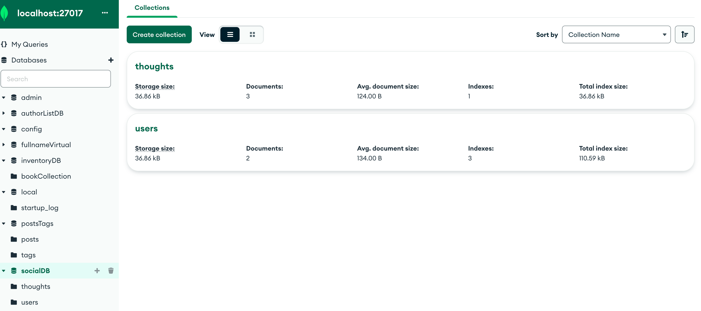
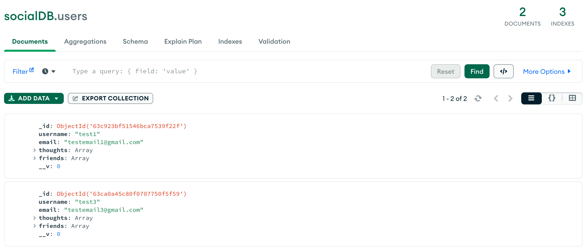
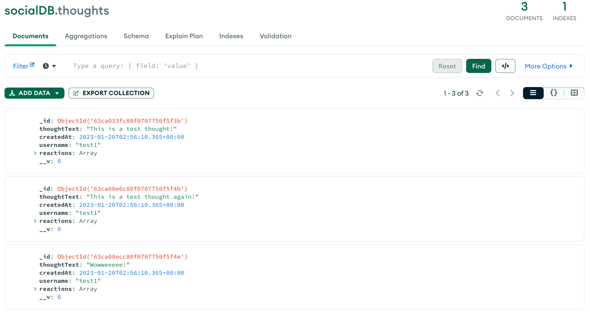

# Social Network API (MongoDB & Mongoose)

  ## Description

MongoDB is a popular choice for many social networks due to its speed with large amounts of data and flexibility with unstructured data. The following application is a social network web app where users can share their thoughts, react to friends’ thoughts, and create a friend list. Using Express.js for routes, MongoDB for databasing and Mongoose ODM. To test the database, Insomnia was used to look at the functionality by seeding the data.

  ## Table of Contents 
  - [Description](#description)
  - [Installation](#installation)
  - [Usage](#usage)
  - [Testing](#testing)
  - [Questions](#questions)

  ## Installation

  Below is an example of how you can download the project onto your own device:

  1. Open your devices terminal application
  2. Locate to the correct file destination that you are wanting to download this project to
  3. Clone the repository using this link: 
      ```md
          git clone https://github.com/squrpe/social-network-api.git
      ```
  4. You may get prompted to input you github details, thus do so. Otherwise, the project will now be succesfully installed onto your device.

  This project contains:
  - Javascript
  - Node.js
  - Express.js
  - MongoDB
  - Mongoose
  - Insomnia

  You will need to download the suitable extensions / applications to test and run the application correctly.

  ## Usage

  - Using node.js via the command line, download the needed npm packages by running `npm i`.
  - To start the server, use the node command `npm start`.

  Below is an example of the program in Insomnia when seeded:

  

  [You can also access the example video by clicking here](https://drive.google.com/file/d/1FKHm-L0DTETe54h2HdsLnvsMDelDkqBV/view)

  If done correctly, MongoDB Compass will reflect the same information:

  
  
  ## Testing
  
  Using Insomnia, the following routes were used to test and seed the functionality behind the application. The above video demonstrates how to seed each route.

  User
  - Find All Users: `GET` `/api/users`
  - Find Single User by Id: `GET` `/api/users/:userId`
  - Create User: `POST` `/api/users`
  - Update User by Id: `PUT` `/api/users/:userId`
  - Delete User by Id: `DELETE` `/api/users/:userId`

  Friend
  - Add Friend: `POST` `/api/users/:userId/friends/:friendId`
  - Remove Friend: `DELETE` `/api/users/:userId/friends/:friendId`

  Thought
  - Find All Thoughts: `GET` `/api/thoughts`
  - Find Single Thought by Id: `GET` `/api/thoughts/:thoughtId`
  - Create Thought: `POST` `/api/thoughts`
  - Update Thought by Id: `PUT` `/api/thoughts/:thoughtId`
  - Delete Thought by Id: `DELETE` `/api/thoughts/:thoughtId`

  Reaction
  - Create Reaction by Id: `POST` `/api/thoughts/:thoughtId/reactions/:reactionId`
  - Delete Reaction by Id: `DELETE` `/api/thoughts/:thoughtId/reactions/:reactionId`

  ## Questions

  If you have any questions, contact me here:
  - Email: squrpe@example.com

  And if you want to see my additonal work, check out my Github:
  - Github: [squrpe](https://github.com/squrpe)

  Deployment of the project:
  - [https://github.com/squrpe/social-network-api](https://github.com/squrpe/social-network-api)